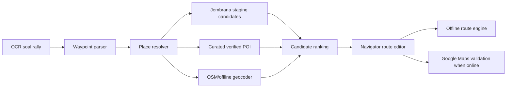

# Jembrana Maps Base CSV Assessment

Source file reviewed: `C:\Users\INTEL\Downloads\jembrana_maps_base_clean.csv`

## Verdict

File ini layak masuk ke sistem sebagai **Google validation / place resolver staging dataset** untuk area Jembrana.

File ini tidak boleh diperlakukan sebagai:
- peta offline,
- jaringan jalan,
- routing graph,
- sumber permanen master POI offline tanpa verifikasi ulang.

Alasan teknisnya sederhana: CSV ini berisi titik POI, bukan geometri jalan. Nilainya paling besar untuk membantu OCR soal rally mengenali waypoint seperti balai banjar, sekolah, kantor desa, dan landmark lokal, lalu memvalidasi kandidat rute ke Google Maps saat online.

## Data Profile

Hasil pembacaan CSV:

| Check | Hasil |
|---|---:|
| Total baris | 239 |
| Unique `place_id` | 239 |
| Unique `data_id` | 239 |
| Blank latitude/longitude | 0 |
| Koordinat di luar batas kasar Bali | 0 |
| Baris dengan `google_maps_url` | 239 |
| Baris dengan `thumbnail_url` | 230 |
| Baris dengan `reviews_url` | 139 |
| Baris dengan `duplicate_count_removed > 0` | 22 |
| Nama kosong | 0 |
| Kecamatan kosong | 0 |
| Desa/kelurahan kosong | 0 |
| Kategori kosong | 0 |
| Jalan kosong | 11 |
| Rating kosong | 100 |
| Negara bukan `ID` | 0 |

Distribusi kecamatan:

| Kecamatan | Jumlah |
|---|---:|
| Mendoyo | 80 |
| Negara | 53 |
| Jembrana | 39 |
| Melaya | 39 |
| Pekutatan | 28 |

Distribusi kelompok kategori:

| Kelompok | Jumlah |
|---|---:|
| Balai Banjar/Komunitas | 139 |
| Pendidikan | 79 |
| Pemerintahan/Desa | 14 |
| Lainnya | 7 |

Ini sangat relevan untuk time rally karena soal sering memakai penanda lokal seperti `BR.`, `SDN`, `SMPN`, `Perbekel`, kantor desa, dan balai banjar.

## Implementation Fit

### Cocok Untuk

- OCR waypoint resolver: mencocokkan hasil OCR soal ke kandidat POI.
- Probabilistic route reasoning: memberi kandidat waypoint saat teks soal ambigu.
- Google Maps validation: menyimpan `place_id` untuk lookup ulang saat online.
- Field test Jembrana: daftar waypoint awal yang bisa diverifikasi manual.
- Alias dictionary: membuat variasi nama seperti `BR`, `Balai Banjar`, `SDN`, `Sekolah Dasar`.

### Tidak Cocok Untuk

- Offline route calculation utama.
- Tile cache.
- Valhalla/OSRM routing graph.
- Master POI permanen tanpa verifikasi lapangan atau sumber data yang boleh disimpan.

## Data Governance Decision

Google Places policy memperbolehkan penyimpanan `place_id`, tetapi Places content mempunyai pembatasan caching/storage dan atribusi. Maka CSV ini harus dipisahkan dari master POI offline.

Keputusan repo:

1. Raw file tetap berada di staging area:
   `data/raw/google_validation/jembrana/`
2. Output sanitasi dari importer diberi label:
   `source=google_validation_import`
   `source_license=restricted_google_derived`
   `verification_status=needs_field_verification`
3. Data yang masuk ke master offline:
   `data/curated/places/jembrana/`
   hanya boleh dari manual survey, KMPAL verified, OSM-compliant, atau sumber lokal yang jelas izinnya.
4. `place_id` boleh dipakai untuk validasi online dan refresh kandidat, bukan untuk membangun database offline permanen berisi Google content.

## Minimal Column Mapping

Staging columns yang berguna:

| CSV column | System field | Catatan |
|---|---|---|
| `nama_tempat` | `name` | Dipakai resolver. |
| `kelompok_kategori` | `category_group` | Untuk klasifikasi waypoint. |
| `kategori` | `category` | Untuk ranking kandidat. |
| `kecamatan` | `district` | Admin filter. |
| `desa_kelurahan` | `village` | Admin filter. |
| `latitude` | `lat` | Staging only sampai verified. |
| `longitude` | `lng` | Staging only sampai verified. |
| `place_id` | `google_place_id` | Boleh disimpan untuk lookup ulang. |
| `google_maps_url` | `google_maps_url` | Validasi manual/online only. |
| `query_sumber` | `query_source` | Berguna untuk memahami asal pencarian. |
| `source_files` | `source_files` | Traceability. |
| `duplicate_count_removed` | `duplicate_count_removed` | Sinyal dedup. |
| `quality_note` | `quality_note` | Audit kualitas. |

Kolom yang sebaiknya tidak dipakai di curated/offline master:

- `thumbnail_url`
- `reviews_url`
- `rating`
- `jumlah_review`
- histogram review
- `owner`
- `jam_operasional`
- `status_buka`
- `telepon`
- `website`

Kolom tersebut boleh tampil hanya sebagai hasil lookup online yang mematuhi atribusi dan Terms, bukan sebagai konten offline permanen.

## Recommended Repo Placement

```text
data/
  raw/
    google_validation/
      jembrana/
        README.md
        jembrana_place_candidates_staging.csv       # generated, restricted-use
        import_report.md                            # generated
  curated/
    places/
      jembrana/
        README.md
        jembrana_verified_places.geojson            # only verified sources
        jembrana_place_aliases.csv                  # local aliases

tools/
  importers/
    jembrana_google_validation_csv.py
```

## Runtime Role In The System



## Best Practice Implementation

Tahap 1, paling cepat untuk sprint lapangan:

- Jalankan importer untuk membuat staging candidates dan import report.
- Resolver membaca CSV staging sebagai salah satu provider.
- Ranking kandidat memakai:
  - fuzzy name match,
  - kategori waypoint,
  - kecamatan/desa jika disebut di soal,
  - kedekatan dengan waypoint sebelum/sesudahnya,
  - confidence dari sumber data.
- UI menampilkan kandidat dengan label `Google validation`, bukan `verified`.
- Navigator memilih/menolak kandidat.

Tahap 2, setelah field test:

- Kandidat yang benar dipromosikan ke curated POI setelah diverifikasi.
- Tambahkan alias lokal dari soal rally nyata.
- Simpan hasil koreksi navigator sebagai training data resolver.

Tahap 3, produksi:

- Curated verified POI menjadi default offline.
- Google validation hanya dipakai saat online untuk cross-check.
- Offline route tetap menggunakan OSM/Valhalla/OSRM graph.

## Objective Assessment

Nilai praktis file ini tinggi untuk Jembrana karena 218 dari 239 baris berada pada tiga kategori yang paling sering berguna di soal rally: balai banjar, pendidikan, dan pemerintahan/desa.

Risiko terbesar bukan kualitas koordinat, melainkan governance: file ini terlihat sangat Google-derived karena memiliki `place_id`, Maps URL, thumbnail, review URL, rating, dan review count. Jadi implementasi terbaik adalah staging + verification workflow, bukan import langsung ke master offline.

Keputusan paling sederhana dan akurat: **pakai file ini sebagai resolver assistant dan validation source, lalu promosikan hanya POI yang sudah diverifikasi ke curated offline database.**
