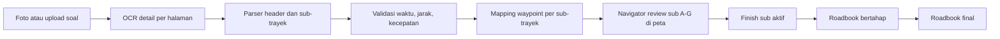

# Photo OCR to Roadbook Workflow

Rancangan lama sudah memiliki bagian dasar: validasi sub-trayek, probability route option, route editor, dan roadbook. Yang belum ada adalah alur lengkap dari foto soal sampai roadbook operasional. Fitur baru ini menutup celah tersebut tanpa mengubah struktur utama.

## Alur Sistem

## Analogi Operasional

Sistem bekerja seperti asisten navigator yang membaca soal lebih dulu, lalu memecah pekerjaan menjadi potongan kecil.

1. Foto soal masuk dari tablet.
2. OCR mengisi nama lomba, lokasi, trayek, total jarak, total waktu, dan isi sub A-G.
3. Validasi menghitung angka:
   - jarak dari teks eksplisit,
   - jarak dari kecepatan x waktu,
   - jarak implisit dari selisih total jika sub tidak mencantumkan jarak.
4. Mapping membuat kandidat rute per sub.
5. Navigator klik sub A untuk melihat peta sub A.
6. Setelah valid, navigator klik `Finish Sub Ini`.
7. Sub A masuk roadbook, driver menjalankan sub A, navigator mulai review sub B.
8. Siklus berjalan sampai sub terakhir selesai.

## Contoh Foto Uploaded Bali

Total waktu terbaca 270 menit dan cocok:

`12 + 38 + 75 + 45 + 50 + 40 + 10 = 270`

Total jarak B-G terbaca 89,83 km. Header menyatakan 93,40 km, sehingga sistem mengisi sub A sebagai jarak implisit:

`93,40 - 89,83 = 3,57 km`

Karena sub A tidak menulis jarak eksplisit, UI memberi status `review`, bukan langsung `valid`.

## Komponen yang Ditambahkan

- `QuestionPhotoIntakePanel`: upload/foto soal dan status OCR.
- `SubTrayekMapPanel`: tab A-G, detail mapping, dan tombol finish.
- `RallyMapCanvas`: peta mengikuti sub aktif.
- `/v1/rally/photo-ocr`: endpoint skeleton untuk worker OCR produksi.
- Fixture `pertamina_merah_putih_bali_trayek_1_photo_ocr.json`.
